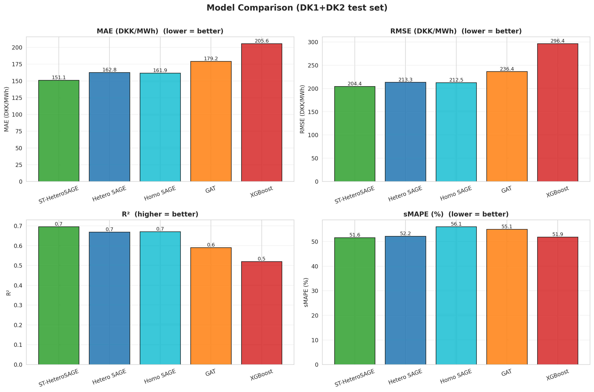
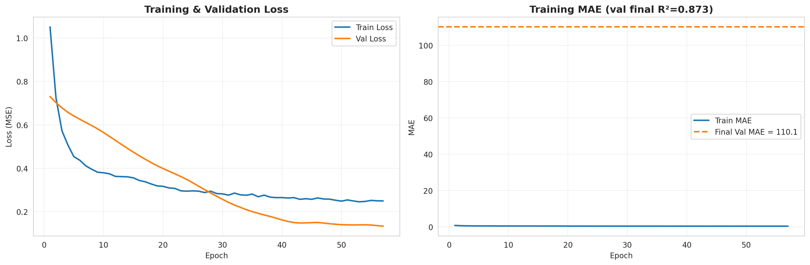
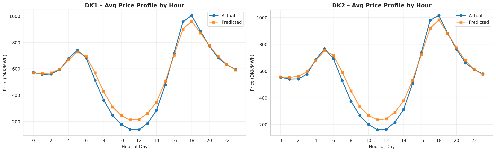
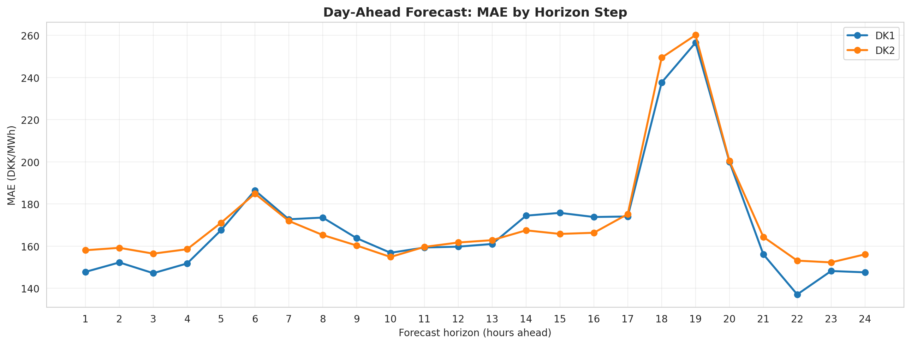
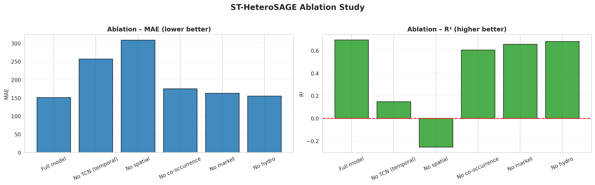
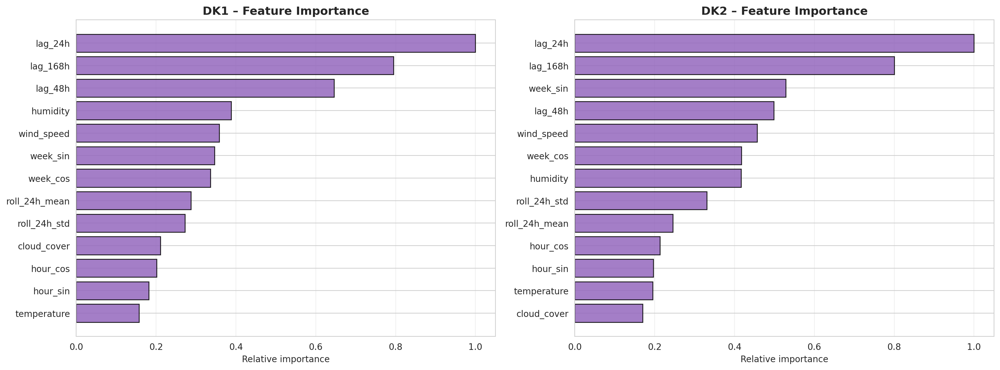
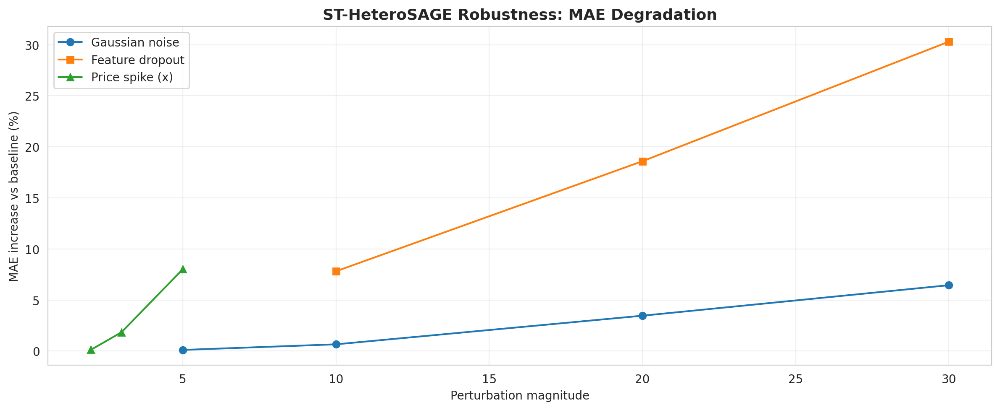

# Heterogeneous Spatio-Temporal GNNs for Nordic Electricity Price Forecasting
### Final Project Report

---

## 1. Executive Summary

This project tackles **multi-area day-ahead electricity price forecasting** for the
Nordic power market. The central idea is to treat the market not as a set of
independent time series, but as a **graph** — where prices in different zones,
different hours, and different fuels all influence one another — and to learn on
that graph with a neural network.

The flagship model, **ST-HeteroSAGE**, combines a heterogeneous graph (typed
nodes and edges) with a causal temporal convolution. It is the most accurate
model in the study:

> **ST-HeteroSAGE reaches MAE = 151.1 DKK / R² = 0.696 on the DK1+DK2 test set —
> 26.5% better than an XGBoost baseline and 6.7% better than a plain GraphSAGE.**

The report walks through the data, the graph construction, the model, and then
the four evidence pillars: **accuracy, forecast behaviour, ablation (what
matters), interpretability, and robustness.**

---

## 2. Problem & Research Question

Day-ahead prices are set once per day at gate closure, so a forecaster only has
information that is known *before* the auction. Prices across Nordic zones move
together (shared weather, shared transmission), and they are driven by
fundamentals like gas price, carbon price, load, and renewable generation.

> **Research question:** *How can a heterogeneous graph be effectively constructed
> and integrated into GNN models to improve the accuracy, interpretability, and
> robustness of multi-area day-ahead electricity price forecasting in the Nordic
> power market?*

The three words in bold — **accuracy, interpretability, robustness** — define the
three things this report has to demonstrate, and they map directly onto Sections
5–9 below.

---

## 3. Data

| Source | Data | Cost |
|--------|------|------|
| Energinet / Nord Pool | DK1, DK2 spot prices, load, renewables | free |
| Energy-Charts (Fraunhofer ISE) | DE spot prices | free |
| Open-Meteo | temperature, wind, cloud, humidity | free |

- **Coverage:** hourly, **2019-12-31 → 2025-09-30** — **50,399 hours per zone**.
- **Split:** strictly chronological **80 / 10 / 20** *(80 train / 10 val / 10 test)*;
  the test window is roughly **Mar–Sep 2025**.
- **No leakage:** every price lag is ≥ 24 h (known at gate closure), and scalers
  are fit on the **training split only**.

---

## 4. The Heterogeneous Graph

The graph has **2 node types** and **5 edge relation types** spanning four market
zones (DK1, DK2, HYDRO, DE).

**Nodes**

| Type | Count | Meaning |
|------|-------|---------|
| `hour` | 201,596 | one node per hour per zone (50,399 h × 4 zones) |
| `market` | 4 | one node per area (NordPool, DK1, DK2, DE) |

Each `hour` node carries **17 features**, grouped as:
- **Price history (5):** `lag_24h`, `lag_48h`, `lag_168h`, `roll24_mean`, `roll24_std`
- **Weather (4):** `temperature`, `wind_speed`, `cloud_cover`, `humidity`
- **Fundamentals (4):** `load_mwh`, `renewable_mwh`, `gas_dkk`, `co2_dkk`
- **Calendar (4):** `hour_sin/cos`, `week_sin/cos`

**Edges**

| Relation | Type | Meaning |
|----------|------|---------|
| `lag_to` | temporal | links an hour to a later hour (24 / 48 / 168 h) |
| `co_occurs_with` | spatial | same-hour price co-movement across zones |
| `belongs_to` / `rev_belongs_to` | membership | hour ↔ its market node |
| `interconnects` | spatial | market ↔ market (transmission capacity) |

> **One honest design caveat:** German prices end on 2024-12-31. To stop stale,
> forward-filled 2025 values from leaking into test predictions, **DE is
> deliberately excluded** from hour-level `co_occurs_with` edges. This is why DE
> (and the synthetic HYDRO zone) score poorly later — they are structurally
> de-weighted, not genuinely forecast.

---

## 5. ST-HeteroSAGE Architecture

Each spatio-temporal block does **spatial message passing first, then a temporal
convolution**:

```
x_dict ─► HeteroConv (co_occurs_with, belongs_to, interconnects)   ← spatial
       ─► per-zone CausalTCN (dilations 1,4,24; kernel 7; RF ≈ 174h) ← temporal
       ─► BatchNorm + residual
   (×2 ST blocks) ─► regression head ─► price
```

- The **CausalTCN** replaces explicit lag edges with a strictly causal ~174-hour
  receptive field — a much richer temporal signal than three discrete lags.
- **BatchNorm, no Dropout** — the two interact badly (dropout masking corrupts BN
  statistics), so BatchNorm alone does the regularising.

---

## 6. Headline Results — Model Comparison

All five models, evaluated on the **same DK1+DK2 test set**:

| Model | MAE ↓ | RMSE ↓ | R² ↑ | Notes |
|-------|------:|-------:|-----:|-------|
| XGBoost (tabular baseline) | 205.62 | 296.41 | 0.520 | 13 engineered features |
| Homogeneous GraphSAGE | 161.91 | 212.53 | 0.671 | single node type |
| GAT (heterogeneous) | 179.20 | 236.41 | 0.591 | attention |
| HeteroSAGE | 162.78 | 213.32 | 0.668 | typed edges, served by the API |
| **ST-HeteroSAGE ★** | **151.08** | **204.36** | **0.696** | CausalTCN + HeteroConv |



**Reading the chart.** Lower is better for MAE/RMSE/sMAPE; higher is better for
R². The story is consistent across every panel: the **graph models beat the
tabular baseline**, and adding the **temporal convolution** (ST-HeteroSAGE) gives
the final edge. The jump from XGBoost → graph is large; the jump from plain
GraphSAGE → ST-HeteroSAGE is smaller but real (and earned mostly by the temporal
component, as Section 8 shows).

---

## 7. Training Behaviour



Train and validation loss fall together and **flatten without diverging** — no
obvious overfitting, which is consistent with the BatchNorm-only regularisation
choice. The final validation **R² ≈ 0.873** on the homogeneous baseline's training
run shown here.

> *Note:* the stored `training_history.json` saved the validation MAE/RMSE/R² as
> **final scalars** rather than per-epoch curves, so the right-hand panel shows the
> per-epoch train MAE with the final validation MAE drawn as a reference line.

---

## 8. Day-Ahead Forecast Behaviour

Accuracy numbers don't show *how* the model behaves. These two views do.

### 8.1 Average daily price shape



Averaged over the test window, the model reproduces the characteristic
**twin-peak day**: a morning ramp around 05:00–06:00, the midday **solar dip**
(prices fall as renewable supply peaks), and the strong **evening peak around
18:00**. Predictions track actuals closely; the main visible bias is a slight
**over-prediction during the midday dip** — the model is a touch conservative
about how cheap the cheapest hours get.

### 8.2 Where error concentrates across the horizon



Error is fairly flat across most of the 24-hour horizon but **spikes at the
17:00–19:00 steps** — exactly the evening peak. This is intuitive: the peak is the
most volatile, highest-stakes part of the day, so it's the hardest to predict.
This single insight (peak hours are the weak point) recurs in the
interpretability analysis below.

---

## 9. Ablation — What Actually Matters

To prove the architecture choices earn their place, each component is removed in
turn and the model retrained.



| Variant | MAE | R² | Verdict |
|---------|----:|---:|---------|
| **Full model** | **151.1** | **0.696** | baseline |
| No spatial (HeteroConv) | 309.0 | **−0.255** | **catastrophic** |
| No TCN (temporal) | 257.3 | 0.148 | **catastrophic** |
| No co-occurrence edges | 175.6 | 0.606 | meaningful hit |
| No market context | 163.1 | 0.658 | small hit |
| No hydro | 155.5 | 0.682 | negligible |

**The headline finding:** removing either the **spatial graph** or the **temporal
convolution** collapses the model — R² even goes *negative* without spatial
message passing (worse than predicting the mean). This is the report's strongest
evidence that *both halves of "spatio-temporal" are essential* — they are not
decoration, they are the model. The market and hydro components, by contrast,
contribute little and could be trimmed.

---

## 10. Interpretability — Which Features Drive Price



This is the **ST-HeteroSAGE** feature importance, normalised to % of the top
feature. Fuel/market/load/generation features are highlighted in **red**:

| Rank | Feature | Importance | Category |
|-----:|---------|-----------:|----------|
| 1 | **`gas_dkk`** | 100 | 🔴 fuel |
| 2 | `price_lag_24h` | ~82 | price history |
| 3 | **`renewable_mwh`** | ~78 | 🔴 generation |
| 4 | `price_lag_48h` | ~50 | price history |
| … | `load_mwh` | ~46 | 🔴 load |
| … | **`co2_dkk`** | ~38 | 🔴 carbon |

**Economic sense check:** the single most important input is the **natural gas
price** — which is exactly right for this market, where gas-fired plants are
frequently the *marginal* (price-setting) generator. Renewable generation and
load follow. The model has learned genuine power-market economics, not just
autocorrelation. (Notably, there is **no oil** feature in this market — gas,
carbon, wind and hydro are the drivers, not oil.)

> **Caveat on magnitudes:** the raw gradient-sensitivity values are all tiny
> (~1e-5) and close together, so treat the **ranking** as the signal, not the
> absolute gaps.

Supporting error analysis (in `st_interpretability.json`) confirms the Section 8
finding: error peaks at **17:00–18:00** and is highest on **Mondays** — the
hardest, most volatile periods to forecast.

---

## 11. Robustness — Does It Hold Up Under Stress

The trained model is hit with three kinds of perturbation at test time.



| Perturbation | Worst case tested | MAE increase | Verdict |
|--------------|-------------------|-------------:|---------|
| Gaussian noise | 30% | **+6.5%** | very robust |
| Price spikes | 5× | **+8.0%** | robust |
| Feature dropout | 30% | **+30.3%** | sensitive |

**Interpretation:** the model is **highly tolerant of input noise and price
spikes** — small, graceful degradation. Its real vulnerability is **missing
features** (dropout): losing 30% of inputs roughly doubles the error. In
deployment terms, *noisy data is fine; missing data is the risk* — which argues
for solid upstream data-quality monitoring rather than worrying about outliers.

---

## 12. Limitations & Honest Caveats

A trustworthy report states what *doesn't* work:

1. **DE and HYDRO zones are not genuinely forecast** (R² ≈ 0). DE is intentionally
   de-weighted because its data ends in 2024; HYDRO is a synthetic/sparse zone.
   All headline metrics are therefore reported on **DK1+DK2 only**.
2. **MAPE is unreliable** here — prices cross/near zero, so MAPE explodes to
   astronomically large values. sMAPE and MAE are the meaningful error metrics.
3. **Feature-importance magnitudes are tiny and close** — the ranking is
   trustworthy; the absolute spacing is not.
4. **Single random seed (42).** Results aren't averaged over multiple seeds, so
   small differences between the close models (HeteroSAGE vs Homogeneous) should
   not be over-interpreted.

---

## 13. Reproducibility & MLOps

- **Deterministic:** `torch.manual_seed(42)`, `np.random.seed(42)`,
  XGBoost `random_state=42`.
- **Environment:** Python 3.11, PyTorch 2.2 (CPU), PyTorch-Geometric ≥ 2.3.
- **Git-versioned artifacts** — checkpoints, metrics, and scalers are committed.
- **Serving:** `docker compose up` brings up MLflow (tracking), a FastAPI
  prediction service, and a 7-page Streamlit dashboard.
- **Monitoring:** rolling MAE and feature-drift checks via the API.

Full reproduction is a single sequence of scripts (`hetero_graph_builder.py` →
train five models → run the three analyses); see the README for the exact
commands.

---

## 14. Conclusion

The project answers its research question affirmatively on all three axes:

- **Accuracy** — ST-HeteroSAGE is the best model, **−26.5% MAE vs XGBoost**, by
  combining a heterogeneous graph with a causal temporal convolution.
- **Interpretability** — feature importance recovers **real market economics**
  (gas price is the top driver), and error analysis localises the hard cases
  (evening peak, Mondays).
- **Robustness** — the model degrades gracefully under noise and price spikes;
  its one real sensitivity is to **missing features**, a data-quality concern
  rather than a modelling flaw.

The ablation study is the strongest single result: stripping out **either** the
spatial **or** the temporal component collapses performance, proving that the
"spatio-temporal" framing is the source of the gain, not incidental complexity.

---

*All figures in this report were generated from the committed JSON artifacts via
`render_graphs.py`; they live in `artifacts/figures/`.*
